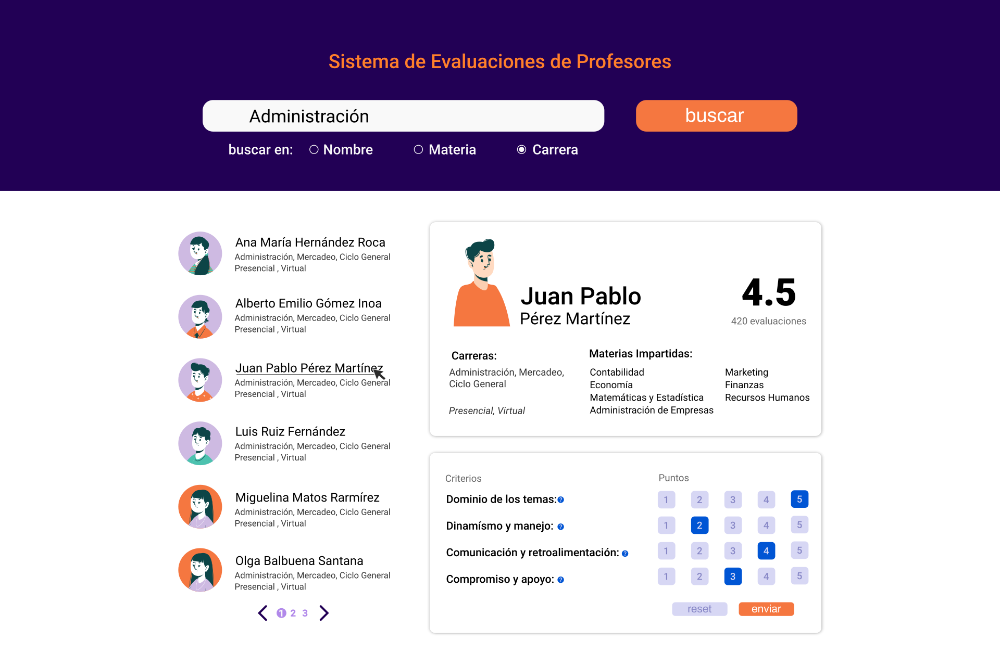

# Sistema de Evaluaciones de Profesores

## Descripción del Proyecto
El **Sistema de Evaluaciones de Profesores** es una plataforma diseñada para evaluar el desempeño de los profesores en diversas áreas académicas. Este sistema permite a los estudiantes y otros evaluadores proporcionar retroalimentación sobre la enseñanza de los profesores, facilitando la mejora continua en la calidad educativa.



## Características Principales
- **Evaluación de Profesores**: Los estudiantes pueden evaluar a los profesores en diferentes criterios como experiencia, diseño de clases, comunicación y compromiso.
- **Búsqueda de Profesores**: Permite buscar profesores por nombre, materia o carrera.
- **Visualización de Resultados**: Muestra el promedio de evaluaciones y detalles de cada profesor.

## Aplicación en vivo:
- Para probar la aplicación accede a [SisEval](https://sis-eval-morefews-projects.vercel.app/).

## Tecnologías Utilizadas
- **Backend**: Node.js, Express.js
- **Base de Datos**: MongoDB con Mongoose
- **Otras Dependencias**: cors, morgan

## Instalación y Ejecución

### Requisitos Previos
- Node.js (versión 20.x)
- MongoDB

### Pasos de Instalación
1. **Clonar el Repositorio**
   ```bash
   git clone <URL-del-repositorio>
   cd sistema-evaluacion-profesores
   ```

2. **Instalar Dependencias**
   ```bash
   npm install
   ```

3. **Configurar Variables de Entorno**
   Crear un archivo `.env` en la raíz del proyecto y agregar las siguientes variables:
   ```env
   PORT=3000
   MONGO_URI=<tu-uri-de-mongodb>
   JWT_SECRET=<tu-secreto-jwt>
   ```

4. **Ejecutar el Servidor**
   ```bash
   npm run server
   ```

## Uso de la Aplicación

### Listar Profesores
Para obtener la lista de profesores, realiza una solicitud GET a:
```
/api/profesores
```

### Buscar Profesores
Para buscar profesores por nombre, materia o carrera, realiza una solicitud GET a:
```
/api/profesores/buscar?tipoBusqueda=<tipo>&terminoBusqueda=<termino>
```

### Obtener Detalles de un Profesor
Para obtener los detalles de un profesor específico, realiza una solicitud GET a:
```
/api/profesores/:id
```

### Crear un Profesor
Para crear un nuevo profesor, realiza una solicitud POST a:
```
/api/profesores
```
Con el siguiente cuerpo de solicitud:
```json
{
  "nombre": "Nombre del Profesor",
  "img": "URL de la imagen",
  "materias": ["Materia1", "Materia2"],
  "carreras": ["Carrera1", "Carrera2"],
  "modalidad": "Presencial/Virtual"
}
```

### Evaluar un Profesor
Para evaluar a un profesor, realiza una solicitud POST a:
```
/api/profesores/evaluar
```
Con el siguiente cuerpo de solicitud:
```json
{
  "profId": "ID del Profesor",
  "evaluadorId": "ID del Evaluador",
  "experiencia": 4,
  "diseno": 5,
  "comunicacion": 4,
  "compromiso": 5
}
```

### Actualizar un Profesor
Para actualizar la información de un profesor, realiza una solicitud PUT a:
```
/api/profesores/:id
```
Con el siguiente cuerpo de solicitud:
```json
{
  "nombre": "Nuevo Nombre del Profesor",
  "materias": ["Nueva Materia1", "Nueva Materia2"],
  "carreras": ["Nueva Carrera1", "Nueva Carrera2"],
  "modalidad": "Presencial/Virtual"
}
```

### Eliminar un Profesor
Para eliminar un profesor, realiza una solicitud DELETE a:
```
/api/profesores/:id
```

## Créditos
- **Desarrollador**: Lenny Gonzalez
- **Licencia**: ISC


## Licencia
Este proyecto está licenciado bajo la Licencia ISC.

---
